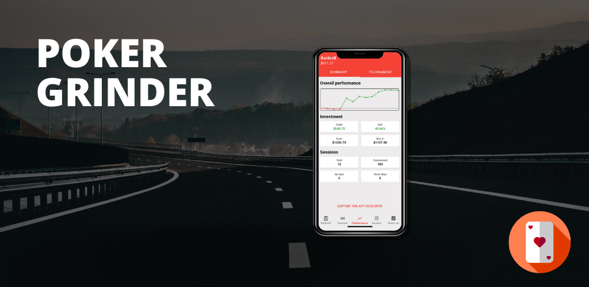
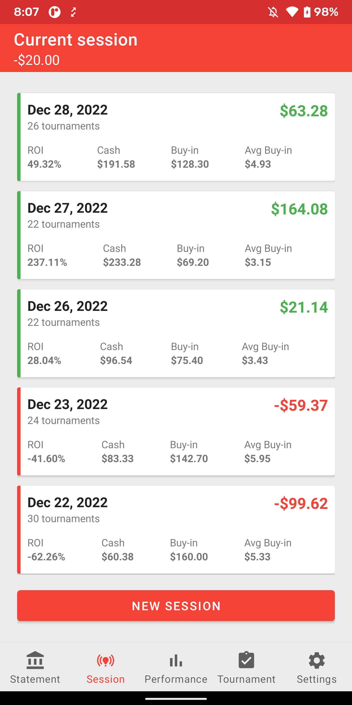

 

[](https://codecov.io/gh/MayconCardoso/poker-grinder) 
[](https://github.com/MayconCardoso/poker-grinder/actions)
[](https://ktlint.github.io/) 
[](https://kotlinlang.org/)
[](https://opensource.org/licenses/Apache-2.0) 

# Context
For those who don't know, apart from a software engineer, I am also a recreative, but profitable, poker player. I used to play poker for fun a couple of years ago and thought the game was  all about being lucky or not. With that in mind, naturally, I used to lose very often for those who know the game theory and the math behind it. So, tired of losing, back in January of 2022 I decided to start studying the game, and bring everything I learnt to my day-to-day evening sessions. Had a tough beggining but managed to achive my year challenge of $100 to $10K by playing sit and go and low, middle level tournaments. 

# About the app
Poker grinder was built with the goal of helping players to manage their game bankroll and also to track the performance of all sessions. You can check the [project roadmap](https://github.com/users/MayconCardoso/projects/2) to see what is coming, now those are the supported features:

  

  

  


### Bankroll Management
* Statement
* Check balance
* Make a deposit
* Withdraw money
* Auto create transactions from grind tournaments buy-ins and profits.

### Tournaments
* Create tournamnets
* Auto create tournaments from grind session flow

### Grind Management
* Create sessions
* Register for tournaments
* Track profit/losses
* Register coin flips
* Check session performance
* Overview chart

### Performance Summary
* Lifetime chart
* Sessions indicator
* Investment indicator
* Breakeven information by indiviual played tournament

# The engineering perspective
It is a simple showcase for a modern and well-crafted Android application, powered by [Kotlin Coroutines](https://developer.android.com/kotlin/coroutines) and [Clean Architecture](https://www.amazon.com.br/Clean-Architecture-Craftsmans-Software-Structure/dp/0134494164). It is a real modularized MVVM application where each feature is individual and don't need anything else besides its own context. Each feature holds its `domain`, `data` and `presentation` module(s) responsible for handling each layer responsibilities of that feature.


## License

```
The MIT License (MIT)

Copyright (c) 2022 Maycon Cardoso

Permission is hereby granted, free of charge, to any person obtaining a copy
of this software and associated documentation files (the "Software"), to deal
in the Software without restriction, including without limitation the rights
to use, copy, modify, merge, publish, distribute, sublicense, and/or sell
copies of the Software, and to permit persons to whom the Software is
furnished to do so, subject to the following conditions:

The above copyright notice and this permission notice shall be included in
all copies or substantial portions of the Software.

THE SOFTWARE IS PROVIDED "AS IS", WITHOUT WARRANTY OF ANY KIND, EXPRESS OR
IMPLIED, INCLUDING BUT NOT LIMITED TO THE WARRANTIES OF MERCHANTABILITY,
FITNESS FOR A PARTICULAR PURPOSE AND NONINFRINGEMENT. IN NO EVENT SHALL THE
AUTHORS OR COPYRIGHT HOLDERS BE LIABLE FOR ANY CLAIM, DAMAGES OR OTHER
LIABILITY, WHETHER IN AN ACTION OF CONTRACT, TORT OR OTHERWISE, ARISING FROM,
OUT OF OR IN CONNECTION WITH THE SOFTWARE OR THE USE OR OTHER DEALINGS IN
THE SOFTWARE.
```
